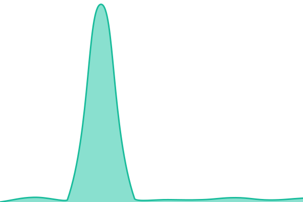

# [📈 Live Status](https://status.hlnet.us): <!--live status--> **🟧 Partial outage**

This repository contains the open-source uptime monitor and status page for [Hugo](hlnet.us), powered by [Upptime](https://github.com/upptime/upptime).

With [Upptime](https://upptime.js.org), you can get your own unlimited and free uptime monitor and status page, powered entirely by a GitHub repository. We use [Issues](https://github.com/h-lopez/status.hlnet.us/issues) as incident reports, [Actions](https://github.com/h-lopez/status.hlnet.us/actions) as uptime monitors, and [Pages](https://status.hlnet.us) for the status page.

<!--start: status pages-->
<!-- This summary is generated by Upptime (https://github.com/upptime/upptime) -->
<!-- Do not edit this manually, your changes will be overwritten -->
<!-- prettier-ignore -->
| URL | Status | History | Response Time | Uptime |
| --- | ------ | ------- | ------------- | ------ |
|  [hlnet.us](https://hlnet.us) | 🟥 Down | [hlnet-us.yml](https://github.com/h-lopez/status.hlnet.us/commits/HEAD/history/hlnet-us.yml) | 

 3498ms
     
 | 

<a href="https://status.hlnet.us/history/hlnet-us">99.53%</a>
    

|  [plex.hlnet.us](https://plex.hlnet.us) | 🟩 Up | [plex-hlnet-us.yml](https://github.com/h-lopez/status.hlnet.us/commits/HEAD/history/plex-hlnet-us.yml) | 

 217ms
     
 | 

<a href="https://status.hlnet.us/history/plex-hlnet-us">100.00%</a>
    

|  [requests.hlnet.us](https://requests.hlnet.us) | 🟩 Up | [requests-hlnet-us.yml](https://github.com/h-lopez/status.hlnet.us/commits/HEAD/history/requests-hlnet-us.yml) | 

 1094ms
     
 | 

<a href="https://status.hlnet.us/history/requests-hlnet-us">100.00%</a>
    

<!--end: status pages-->

[**Visit our status website →**](https://status.hlnet.us)

## 📄 License

- Powered by: [Upptime](https://github.com/upptime/upptime)
- Code: [MIT](./LICENSE) © [Anand Chowdhary](https://anandchowdhary.com)
- Data in the `./history` directory: [Open Database License](https://opendatacommons.org/licenses/odbl/1-0/)
